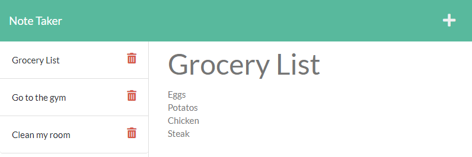

# Weather Dashboard

Take notes of all the things you have to do with this app and delete them when they are finished! Use this as a reminder and don't forget anything.

## Site Picture

## Getting Started

These instructions will get you a copy of the project up and running on your local machine for development and testing purposes. See deployment for notes on how to deploy the project on a live system.

* Click on the green button named Code on github and copy the URL of the repository.
* Use the command git clone (repository's URL) to clone all existing project on your local machine.
* Start your testing with your own clone of the repository using your preferred code editor.

## Prerequisites

* Git
* Node.js
* NPM
* Express
* fs
* Util

## Installing

* Fork the project to get your own copy of the repository.
* Clone the repository.
* Make your changes and testing.
* Deploy on github by going to the repository and on settings in the pages tab save the source to main for deployment and demo.

## Built With

* [HTML](https://developer.mozilla.org/en-US/docs/Web/HTML)
* [CSS](https://developer.mozilla.org/en-US/docs/Web/CSS)
* [Javascript](https://developer.mozilla.org/en-US/docs/Web/javascript)
* [JQuery](https://jquery.com/)
* [Bootstrap](https://getbootstrap.com/)
* [Node.js](https://nodejs.org/en/)
* [NPM](https://docs.npmjs.com/)
* [Express](https://expressjs.com/)
* [FS](https://nodejs.org/api/fs.html)
* [Util](https://nodejs.org/api/util.html)

## Deployed Link

* [See Live Site on Github](https://andresliu22.github.io/note-taker/)
* [See Live Site on Heroku](https://andresliu-note-taker.herokuapp.com/)

## Authors

* **Andres Liu** 

## Contacts

- [Link to Portfolio Site](https://andresliu22.github.io/portfolio/)
- [Link to Github](https://github.com/andresliu22/)
- [Link to LinkedIn](https://www.linkedin.com/in/andresliu22/)

## License

This project is licensed under the MIT License.

## Acknowledgments

* Always do some research to get the best possible way to code anything.
* Make the website and code easy to read for viewers and other developers by using brief comments.
* Be use to commit to get an insight of what you have done for each progress you make.
